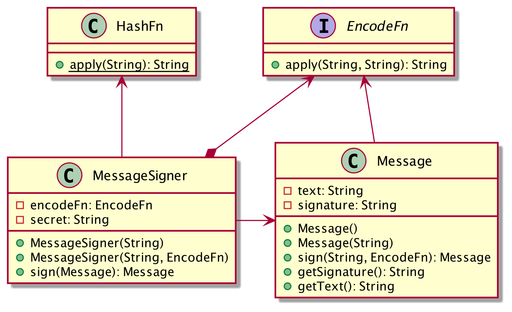

# Exercise 0: Rewrite Java in TypeScript

The languages Java and TypeScript have very similar syntax. On the first sight, they only differ in the position of the type annotations, i.e. `String foo` vs. `foo: string` and the use of the lambda expression `->` instead of the arrow function `=>`. On a closer look you'll notice several other differences. Let's take a closer look and rewrite this Java code in TypeScript.

Consider the Java program in this package as illustrated with the following class diagram:

## Goals

* Make the Java package `com.quatico.workshops.webcomponents.message` available in the TypeScript project as a module `message`
* Replace the `Main` class with a default executing module script
* Replace the classes `Message` and `MessageSigner` with corresponding TypeScript classes
* Introduce a caller signature for the `EncodeFn` function
* Replace the functional interface `HashFn` with a TypeScript function `hash`

## Stretch goals

* Add unit tests using Jest for the classes `Message` and `MessageSigner` (see JUnit tests in the `src/test/java/com/quatico/workshops/webcomponents/message` package)
* Add unit tests using Jest for the function `hash`
* Improve the implementation of `HashFn.java` using your IDEs Java refactoring capabilities
* Improve the implementation of `hash.ts` using your IDEs TypeScript refactoring capabilities
