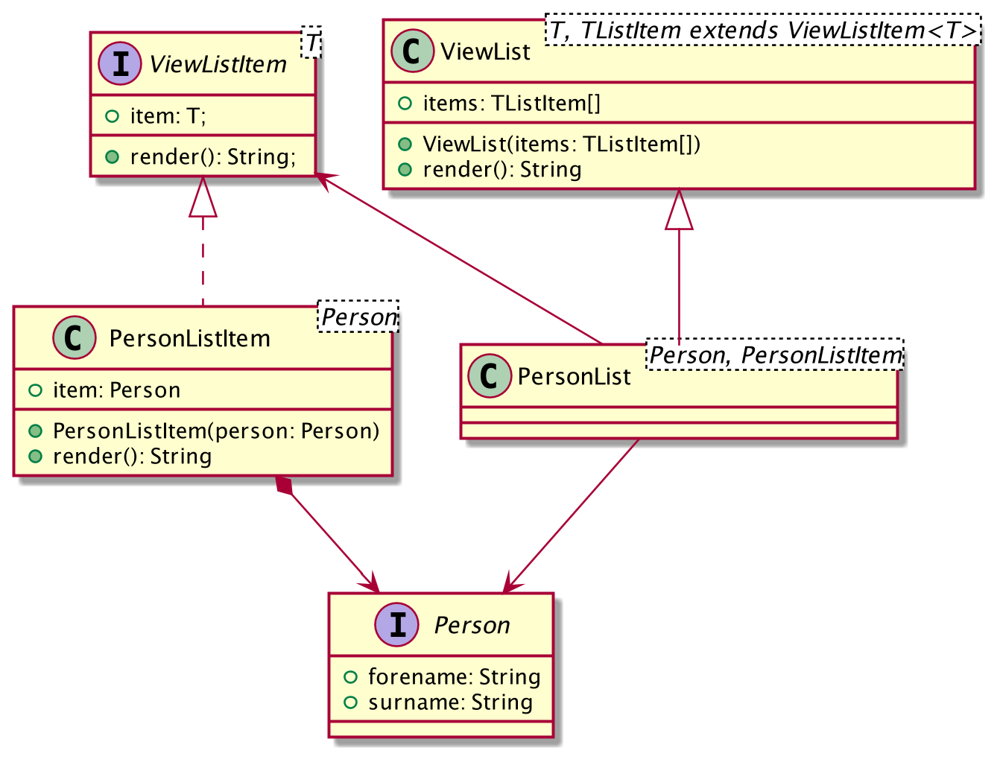

# Exercise 3: Replace classes with functions

TypeScript offers a lot of concepts that are in line with functional programming. Let’s see how we can make our code more functional. In this exercise classes are our major target. Consider the following class diagram:



Classes can be a great way to represent real-world objects. However, here they are too verbose making the rendering process difficult to understand. Go through the existing code replace the classes with functions. Follow the hints below to get started.

## Goals

* Render an array of persons using a function
* Create function `renderPerson` that renders a `Person` as `PersonListItem` does
* Create a generic function `renderList<T>` that takes a render function and returns a function that renders an array T[] into a comma-separated string
* Pass `renderPerson` into `renderList` and render the array of persons:

```typescript
declare const renderPerson: (person: Person) => string;
const people = renderList(renderPerson)([
    {
        forename: "Jane",
        surname: "Doe",
    },
    { forename: "Joe", surname: "Average" },
]);
console.log("People:", people);
```

## Stretch goals

* Declare a type for render functions, e.g., `(obj: T) => string` and use it
* Add unit tests for `renderPerson` and `renderList`
* Improve the naive implementation, e.g. empty objects should be rendered as empty strings with length 0
